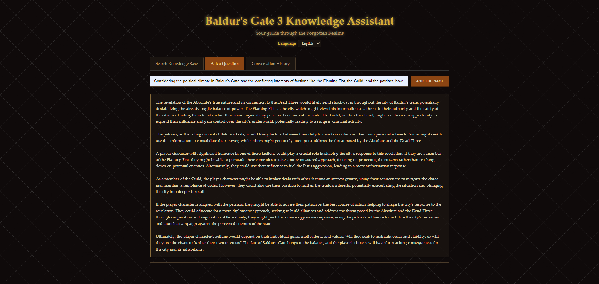
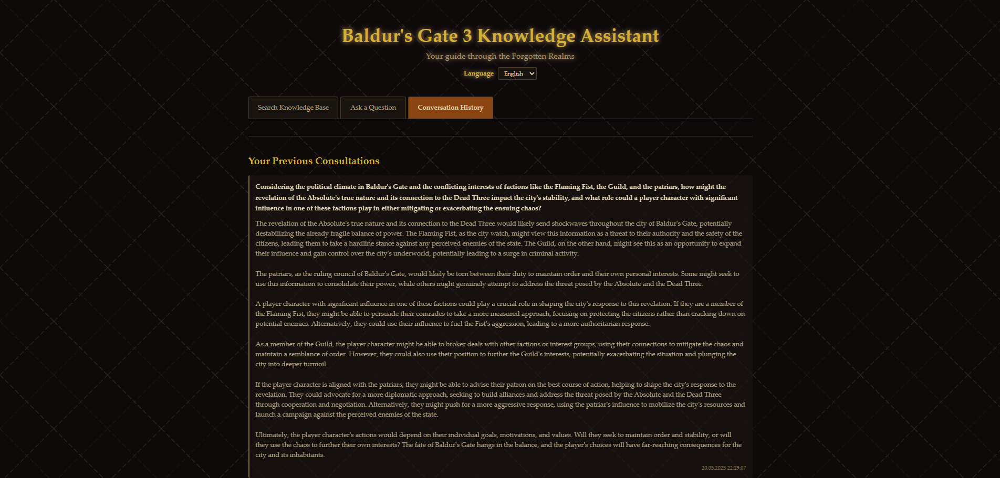
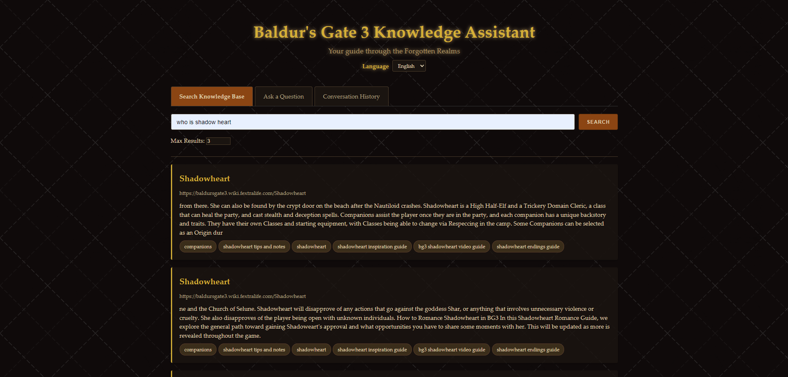

# bg3-rag-agent

A Retrieval-Augmented Generation (RAG) system and API for Baldur's Gate 3, enabling semantic search and intelligent Q&A over wiki-based game knowledge.

---

## Screenshots

|                      Ask a Question Page                      |                         Conversation History                         |                         Search Knowledge Base Page                          |
| :-----------------------------------------------------------: | :------------------------------------------------------------------: | :-------------------------------------------------------------------------: |
|  |  |  |

---

## Key Features

- **Wiki Data Ingestion:** Scrape and parse Baldur's Gate 3 wiki content into structured JSON.
- **Chunking:** Split large documents into overlapping, manageable text chunks for better retrieval.
- **Embeddings:** Generate semantic embeddings for each chunk using the free `all-MiniLM-L6-v2` model.
- **Vector Search:** Store and search embeddings efficiently with FAISS.
- **LLM Integration:** Utilizes "llama-3.3-70b-versatile" via the Groq API for generating answers.
- **API:** Query the knowledge base via a FastAPI endpoint for integration with tools or UIs.
- **Conversation History:** Stores conversation history in a PostgreSQL database.
- **Dockerized:** Fully containerized for easy setup and reproducibility.
- **Frontend:** Simple web frontend for user interaction (see `frontend/`).
- **Modular & Extensible:** Easily add new data sources, LLMs, or vector DBs.
- **Testing:** Includes test scripts for pipeline and API validation.

---

## High-Level Architecture & Pipeline

1. **Scraping:** (Optional) Download raw HTML wiki pages (`data/raw_html/`).
2. **Parsing:** Convert HTML to structured JSON (`data/parsed_json/`).
3. **Chunking:** Split documents into overlapping text chunks (`data/chunked_json/`).
4. **Embedding:** Generate vector embeddings for each chunk (`embeddings/bg3_vectorstore/`).
5. **Vector Search:** Use FAISS for fast semantic retrieval.
6. **LLM Answering:** Use Groq API (llama-3.3-70b-versatile) to generate answers from retrieved context.
7. **API Serving:** FastAPI app exposes endpoints for search and Q&A.
8. **Frontend:** Simple web UI for user queries (served from `frontend/`).
9. **Conversation History:** Store and retrieve chat history in PostgreSQL.

---

## Project Structure

```
bg3-rag-agent/
├── data/
│   ├── raw_html/         # (Optional) Scraped HTML pages
│   ├── parsed_json/      # Parsed wiki data (title, url, content, tags)
│   └── chunked_json/     # Pre-chunked documents
├── embeddings/
│   └── bg3_vectorstore/  # FAISS index and metadata
├── src/
│   ├── scraper.py        # HTML scraper (currently empty)
│   ├── parser.py         # HTML to JSON converter (file missing)
│   ├── embedder.py       # Chunking logic
│   ├── vectorizer.py     # Embedding + FAISS logic
│   ├── api.py            # FastAPI app
│   ├── db.py             # PostgreSQL database handling
│   ├── llm.py            # LLM (Groq API - llama-3.3-70b-versatile) configuration
│   ├── rag_pipeline.py   # RAG pipeline logic
│   └── tests/            # Test scripts
├── frontend/             # Simple web frontend (index.html, lang/)
├── main.py               # Entrypoint (optional)
├── requirements.txt      # Python dependencies
├── Dockerfile            # Docker build file
├── docker-compose.yml    # Docker Compose config
└── .env                  # Environment variables
```

---

## How It Works

1. **Data Preparation:**
   - Place raw HTML or parsed JSON in `data/`.
   - Run chunking and embedding scripts to build the vector store.
2. **Serving:**
   - Start the API server (Docker or Python).
   - Optionally, serve the frontend for user queries.
3. **Querying:**
   - User submits a question via API or frontend.
   - System retrieves relevant chunks using FAISS.
   - LLM generates an answer using retrieved context.
   - Conversation history is stored for context-aware Q&A.

---

## Quickstart

### 1. Build and Start the Environment

```pwsh
# Build the Docker image
docker-compose build

# Run chunking (if not already done)
docker-compose run --rm rag-agent python src/embedder.py

# Run embedding and FAISS index creation
docker-compose run --rm rag-agent python src/vectorizer.py

# Start the FastAPI server
docker-compose up
```

### 2. Query the API

- Visit [http://localhost:8000/docs](http://localhost:8000/docs) for interactive docs.
- Use the `/search` endpoint with a JSON body like:

```json
{
  "query": "What is the best rogue build in Baldur's Gate 3?",
  "top_k": 3
}
```

### 3. Example Query via CLI

```pwsh
docker-compose run --rm rag-agent python src/tests/query_test.py
```

---

## Running the Frontend

### Option 1: Simple Method

Use the included helper script to start both API and frontend:

```pwsh
# Start both API server and frontend
python start_app.py
```

This will:

1. Start the FastAPI server on port 8000
2. Start a simple HTTP server for the frontend on port 3000
3. Automatically open your browser to the frontend

### Option 2: Manual Setup

If you prefer to run them separately:

1. Start the API server:

```pwsh
# Start the API using main.py CLI
python main.py serve
# OR directly with uvicorn
uvicorn src.api:app --host 0.0.0.0 --port 8000 --reload
```

2. Serve the frontend:

```pwsh
cd frontend
python -m http.server 3000
```

3. Open your browser to: http://localhost:3000

---

## Environment & Configuration

- **.env:** Store API keys, database URLs, and other secrets here. Example variables:
  - `GROQ_API_KEY`, `POSTGRES_URL`, `LLM_MODEL`, etc.
- **requirements.txt:** Python dependencies for all scripts and API.
- **Docker Compose:** Handles multi-container setup (API, DB, etc.).

---

## Requirements

- Docker & Docker Compose (recommended)
- Or: Python 3.8+, see `requirements.txt`

---

## Technologies Used

- Python, FastAPI, FAISS, Sentence Transformers, LangChain, Docker, PostgreSQL, Groq API (llama-3.3-70b-versatile)

---

## Customization & Extending

- Add new data by placing parsed JSON in `data/parsed_json/` and rerunning chunking/embedding steps.
- Extend the API in `src/api.py` for more advanced RAG or answer generation.
- Swap out LLMs, vector DBs, or add new data sources as needed.

---

## Testing

- Test scripts are in `src/tests/`.
- Example: `query_test.py` for end-to-end pipeline validation.
- Add more tests as you extend the system.

---

## License

MIT
